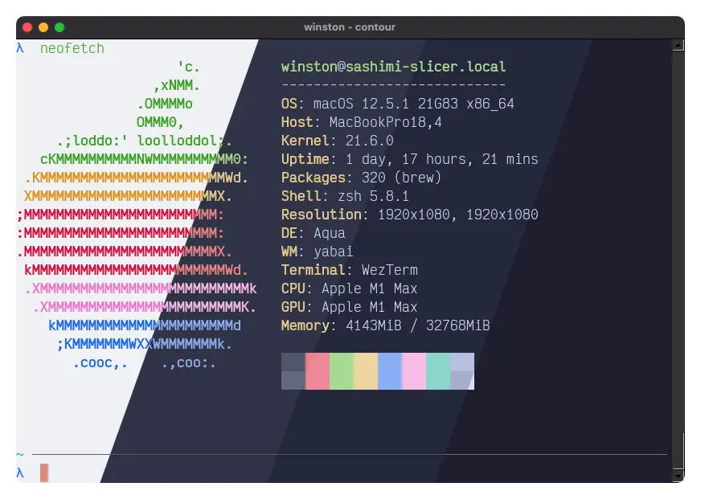

<h3 align="center">
	<br/>
	
	Catppuccin for <a href="https://github.com/contour-terminal/contour">Contour</a>
	
</h3>

<p align="center">
    <a href="https://github.com/TarunDaCoder/contour/stargazers"></a>
    <a href="https://github.com/TarunDaCoder/contour/issues"></a>
    <a href="https://github.com/TarunDaCoder/contour/contributors"></a>
</p>

<p align="center">
  
</p>

## Usage

1. Copy the contents of `catppuccin.yml` into your Contour config file (`~/.config/contour/contour.yml`), under `color_schemes`:
```yaml
color_schemes:
    catppuccin_latte:
        # ...
    catppuccin_frappe:
        # ...
    catppuccin_macchiato:
        # ...
    catppuccin_mocha:
        # ...
```

2. Add `colors: "catppuccin_mocha"` (or `macchiato`, `frappe`, `latte`) in your `contour.yml`:
```yaml
profiles:
    main:
        colors: "catppuccin_mocha" # or macchiato, frappe, latte
```

## 💝 Thanks to

- [TarunDaCoder](https://github.com/TarunDaCoder)
- [LudoPinelli](https://github.com/LudoPinelli)
- [VictorTennekes](https://github/VictorTennekes) for the Screenshot

&nbsp;

<p align="center"></p>
<p align="center">Copyright &copy; 2021-present <a href="https://github.com/catppuccin" target="_blank">Catppuccin Org</a>
<p align="center"><a href="https://github.com/catppuccin/catppuccin/blob/main/LICENSE"></a></p>
